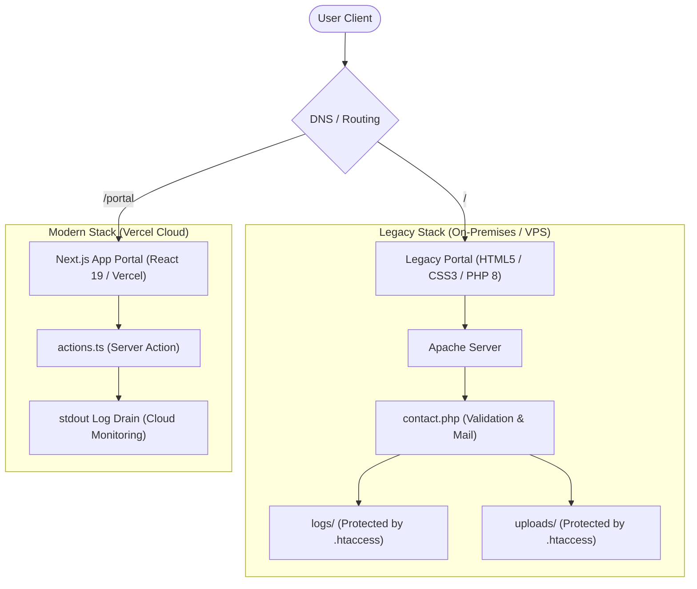
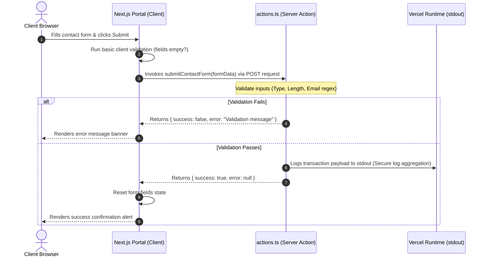

# Avotech Solutions - Technical Documentation & Deployment Guide

This repository contains the dual-stack corporate portal for Avotech Solutions, a B2B consultancy enabling food processing and value-addition industries in Kenya and East Africa. 

The project is structured as a decoupled deployment: a lightweight legacy portal and a modern Next.js client portal. Both are engineered to Roy's brand specifications (Georgia headings, Calibri body, navy `#0F1B2D`, teal `#00869B`, gold `#C09E5A`), with strict design alignment (no glassmorphism, no gradient backgrounds, and no emojis).

---

## Technical Stack Specifications

| Component | Legacy Stack | Next.js Stack |
|---|---|---|
| Core Engine | HTML5, JavaScript (ES6) | Next.js 16 (App Router), TypeScript 5, React 19 |
| Styling Layer | Vanilla CSS3 (Flat Editorial Layout) | CSS3 Custom Properties (globals.css, inline styles) |
| Runtime Environment | PHP 8.x + Apache/Nginx | Vercel Serverless Functions (Node.js 20+) |
| Form Processing | secure contact.php | Node.js Server Action (actions.ts) |
| Security Controls | Directory isolation (.htaccess), inputs sanitization | Input length boundaries, strict regex validation, stdout logging |
| Logging Mechanism | Encrypted directory log-rotation (logs/) | Secure stdout logging for Vercel Log Drains |

---

## Decoupled System Architecture

---

## Secure Submission Lifecycles

### Next.js Server Action Workflow

For cloud deployments on platforms like Vercel, traditional local file logging or execution is unsafe. Form data is processed via secure Server Actions and piped to stdout, where Vercel's logging system captures and stores telemetry safely.

### Legacy PHP Submission Lifecycle

The legacy PHP stack enforces secure logging and uploads folder isolation through local `.htaccess` security policies to prevent arbitrary code execution and unauthorized data scraping.

- **logs/.htaccess**: Denies all web requests to prevent PII leaks of contact logs (`Require all denied`).
- **uploads/.htaccess**: Disables script execution and limits MIME types to prevent malicious shell uploads.

---

## Vercel Deployment Instructions

To deploy the modern portal on Vercel:

1. Import the GitHub repository `ogmanu41/avotech-solutions` into your Vercel Dashboard.
2. In the project creation settings, configure the **Root Directory** to `avotech-next`.
3. Ensure the framework preset is set to **Next.js**.
4. Set the node.js runtime version to **20.x** or higher.
5. Deploy. Vercel will build the Next.js app located in the subdirectory, leaving the legacy files isolated.

---

## Technical Debt & Performance Audit

1. **Three.js Dependency**: The Next.js project contains `three` and `@types/three` dependencies. These are legacy elements from the design templates used for a canvas backdrop. The animation was disabled to adhere to performance and styling standards (avoiding CPU animation slop). These dependencies should be pruned in the next package refactor.
2. **Database Integration (Phase 2)**: Both contact forms write to non-persistent outputs (stdout logs on Next.js, text files on PHP). In Phase 2, a persistent database (e.g., PostgreSQL or Supabase) must be connected to centralize B2B customer inquiries.